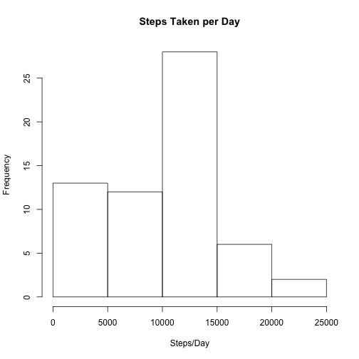

#Loading and preprocessing the data


```r
temp <- tempfile()
fileURL <- "https://d396qusza40orc.cloudfront.net/repdata%2Fdata%2Factivity.zip"
download.file(fileURL, temp, method="curl")
data <- read.csv(unzip(temp))
unlink(temp)
(dateDownloaded <- date())
```

```
## [1] "Sun Jul 19 03:57:44 2015"
```

#What is mean total number of steps taken per day?

```r
steps_day <- rowsum(data$steps,group=data$date,na.rm=TRUE)
```


```r
hist(steps_day, main="Steps Taken per Day",xlab="Steps/Day")
```

 


```r
mean_steps_day <- mean(steps_day,na.rm=TRUE)
median_steps_day <- median(steps_day,na.rm=TRUE)
```
The mean number of steps taken per day is 9354.23.
The median number of steps taken per day is 1.0395 &times; 10<sup>4</sup>.

#What is the average daily pattern?

```r
average_interval <- aggregate(data$steps,by=list(data$interval),FUN=mean,na.rm=TRUE)
names(average_interval) <- c("Interval","Average")
plot(average_interval$Interval,average_interval$Average,type="l",
      main="When are the most steps taken on average?",xlab="5 minute interval",
      ylab="Average steps per interval")
```

 

```r
max_steps_interval <- average_interval[average_interval$Average==max(average_interval$Average),]
max_steps_interval[,1]
```

```
## [1] 835
```

#Impute missing data by replacing missing values with the mean number of steps taken for that interval

```r
sum(is.na(data$steps))
```

```
## [1] 2304
```


```r
data_nomiss <- data
for (i in 1:nrow(data)){
  if (is.na(data[i,"steps"])==TRUE){
    interval <- data[i,"interval"]
    data_nomiss[i,"steps"] <- average_interval[average_interval$Interval==interval,][,2]
    }
  else{
    data_nomiss[i,"steps"] <- data_nomiss[i,"steps"]
  }
}
```


```r
steps_day_nomiss <- rowsum(data_nomiss$steps,group=data_nomiss$date)
hist(steps_day_nomiss, main="Steps Taken per Day with Missing Data Imputed",xlab="Steps/Day")
```

 


```r
mean_steps_day_nomiss <- mean(steps_day_nomiss)
median_steps_day_nomiss <- median(steps_day_nomiss)
```

The mean number of steps taken per day in the imputed data is 1.0766189 &times; 10<sup>4</sup>.
The median number of steps taken per day in the imputed data is 1.0766189 &times; 10<sup>4</sup>.

Compare imputed mean and median to original mean and median:
1.076619 &times; 10<sup>4</sup> and 1.076619 &times; 10<sup>4</sup> are larger than 9354.23 and 1.0395 &times; 10<sup>4</sup>.

#Are there differences in activity patterns between weekdays and weekends?

```r
data_nomiss$day_of_week <- weekdays(as.Date(data_nomiss$date))
data_nomiss$type_day <- ifelse(data_nomiss$day_of_week == "Saturday" | data_nomiss$day_of_week == "Sunday","Weekend", "Weekday")

data_nomiss$type_day <- as.factor(data_nomiss$type_day)
```


```r
require(lattice)
average_interval_type_day <- aggregate(data_nomiss$steps,by=c(list(data_nomiss$interval),list(data_nomiss$type_day)),FUN=mean)
names(average_interval_type_day) <- c("Interval","Type_Day", "Average")
xyplot(average_interval_type_day$Average~average_interval_type_day$Interval|
         average_interval_type_day$Type_Day,layout=c(1,2),type="l",xlab="Interval",
       ylab="Average Number of Steps")
```

 
